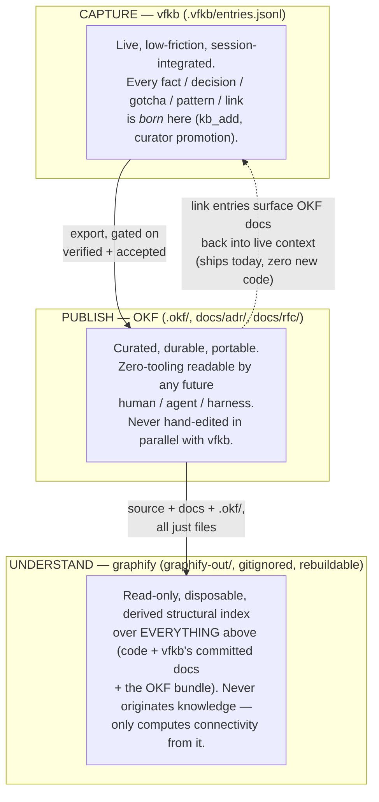

# RFC-020: Layered knowledge management — vfkb (capture), graphify (understand), OKF (publish)

- **Status:** Accepted → [ADR-0046](../adr/ADR-0046-layered-knowledge-capture-understand-publish.md) (ratified 2026-07-08)
- **Date:** 2026-07-07 (revised 2026-07-08 post-v2-ship: gap-review pass — ratchet scoped,
  Brakes named, okf-skill/ADR-0045 reconciled, stale refs refreshed)
- **Deciders:** operator + Claude
- **Relates:** [ADR-0019](../adr/ADR-0019-self-hosted-design-brain.md) (the committed brain this
  RFC exports *from*, never replaces), [ADR-0021](../adr/ADR-0021-auto-distill-and-curator.md)
  (curator/corroboration gate this RFC reuses as its export threshold), [ADR-0001](../adr/ADR-0001-record-decisions-as-adrs.md)
  (ADR immutability, which bounds how the in-place bundle may handle supersession), [ADR-0009](../adr/ADR-0009-decision-identity-and-numbering.md)
  (ADR/RFC file shape this RFC proposes lightly retrofitting), [ADR-0045](../adr/ADR-0045-vfkb-claude-code-plugin.md)
  (the plugin distribution this RFC's export surface rides — see Integration Point 1),
  `docs/H4-DEVELOPMENT-ROADMAP.md` Track 9 Q3 ("AGENTS.md export projection" — this RFC proposes
  widening that render-target work rather than duplicating it),
  [vilosource/okf-skill](https://github.com/vilosource/okf-skill) (the shipped OKF v0.1
  authoring/validation plugin whose `validate_okf.py` this RFC adopts as its conformance Brake).
  Graphify wiring note: this repo's graphify rules live in the machine-local `CLAUDE.local.md`
  (gitignored) — graphify is operator-local tooling with no committed wiring, consistent with its
  Understand-layer role below.

## Context

Two new tools entered this project this session with no prior design record: **OKF** (Open
Knowledge Format **v0.1** — a directory of markdown files with YAML frontmatter, zero SDK, human-
and agent-readable via `cat`; this RFC pins v0.1 as taught and validated by the shipped
[vilosource/okf-skill](https://github.com/vilosource/okf-skill) plugin, whose `validate_okf.py`
is a standalone conformance checker) and **graphify** (turns any folder into a queryable,
community-clustered knowledge graph with an EXTRACTED/INFERRED/AMBIGUOUS honesty tiering). Both are now available
alongside vfkb in every session here, and both are, on the surface, "knowledge management" —
raising the obvious question this RFC answers: what does each one *own*, and how does knowledge
move between them without three independent, drifting sources of truth?

The three systems are not competing — they capture fundamentally different **shapes** of knowledge:

| System | Shape | Write model | Confidence model |
|---|---|---|---|
| **vfkb** | append-only chronological log, typed entries | live, session-hook-integrated, deliberate (`kb_add`) or curator-promoted | `provenance.status` (verified/unverified/stale/expired) + decision `status` (proposed/accepted/superseded) |
| **graphify** | derived structural graph, rebuildable | never hand-authored — mechanically extracted from source+docs, disposable like `dist/` | edge `confidence` (EXTRACTED/INFERRED/AMBIGUOUS + numeric score) |
| **OKF** | curated static reference corpus, directory of typed docs | explicit, infrequent, meant to be portable outside any one harness | none built in — producer discipline only ("never fabricate a resource/timestamp you haven't verified") |

This session independently demonstrated why treating these as interchangeable would be a mistake:
graphify's own extraction was found to have real, reproducible correctness bugs this session
(non-deterministic duplicate document nodes across re-extraction runs, ~200 dangling edges from
AST/semantic ID-scheme mismatches) — its INFERRED/AMBIGUOUS output is a good *lead* for a human to
follow, not a safe thing to publish as fact. Meanwhile vfkb already has a working, exactly-fitting
confidence gate for "this is settled enough to be durable": `promoteIfCorroborated`
(`src/curator.ts`, `PROMOTION_THRESHOLD = 2` net corroborating signals) re-stamps an entry
`verified`. **The design problem this RFC solves is making that existing gate the mandatory
checkpoint before anything reaches OKF — not inventing a new one.**

## Decision

Adopt a three-layer model — **Capture → Understand → Publish** — and assign each system to
exactly one layer. Knowledge flows one direction down this stack via explicit, reviewed steps; it
is never hand-authored in parallel in two layers at once.

**The one-way ratchet (the load-bearing rule):** OKF has no confidence field of its own, so
crossing *into* it is where confidence gets *spent*, never laundered. The publish layer has two
distinct parts, and the ratchet binds them differently:

- **The generated `.okf/` bundle** (Integration Point 1's export target) is where the strict
  rule applies: nothing is exported below its origin system's highest trust tier — vfkb:
  `verified` **and**, for decision-family entries, `accepted` (never `proposed`); graphify:
  `EXTRACTED` only, and even then only via human review, never auto-published. A `superseded`
  decision or a demoted/archived entry does not get silently deleted from the generated bundle
  either — it moves to that bundle's `log.md` (OKF's own reserved convention for a chronological
  record of updates), so history stays honest instead of vanishing.
- **The in-place `docs/adr/` + `docs/rfc/` bundle** (the frontmatter retrofit below) is the
  *deliberation record*, and it is published **as** a deliberation record, not laundered as
  settled fact: every file carries a mandatory `status:` frontmatter field (`proposed` /
  `accepted` / `superseded` / `deprecated`), and consumers filter on it. This is why RFCs —
  proposed decisions by definition, including this one — can conformantly live in the publish
  layer without violating the ratchet: their below-`accepted` status travels *with* them,
  machine-readably, instead of being stripped at the boundary. Supersession here follows
  [ADR-0001](../adr/ADR-0001-record-decisions-as-adrs.md), not `log.md`: ADRs are immutable and never move —
  a superseded ADR stays in place with `status: superseded` frontmatter as the signal. The
  `log.md` convention applies only to the generated bundle, which has no immutability contract
  of its own.

**Enforcement (the Brake, not prose):** this repo's own lesson (ADR-0021, restated in
`CLAUDE.md`) is that a load-bearing prose rule gets skipped; the ratchet therefore ships with
deterministic checks, named in the Definition of Done below — okf-skill's `validate_okf.py`
over the in-place bundle (Phase 0), and a negative projection test asserting `unverified` /
`proposed` entries never appear in the export (Phase 1).

### Integration Point 1 — `vfkb export okf` (extends Track 9 Q3, doesn't duplicate it)

Track 9 Q3 ("AGENTS.md export projection", `docs/H4-DEVELOPMENT-ROADMAP.md`) already scopes a
deterministic render target over the existing `renderContext`/`renderContextBundle`
(`src/engine.ts`) — generated-marked, regenerate-on-demand, never auto-committed. Propose Q3's
scope widen to **two render targets sharing one deterministic-projection engine**: the existing
flat `AGENTS.md` (a whole-brain digest for a cold agent with no vfkb integration) and a new
`.okf/` bundle (individually addressable, typed, linkable concept docs for a reader who wants
*one* thing, not the whole brain). These solve adjacent, not identical, problems — see Alternatives.

Field mapping needs no translation layer, because it's already aligned:
- vfkb `EntryType` (`fact`/`decision`/`gotcha`/`pattern`) → OKF `type` directly. OKF's spec is
  explicit that `type` values are producer-chosen, not a fixed enum — vfkb's own type strings are
  valid as-is.
- vfkb `tags` → OKF `tags`. Direct copy.
- vfkb entry text (already includes the `foldWhy()`-folded `Why: …` line — ADR-0013/existing
  behavior) → OKF body. Reuse verbatim; do not re-derive rationale.
- vfkb `refs`/`link`-type entries → OKF cross-links (bundle-root-relative, per OKF's own
  preference).

**Decision-family entries are a near-zero-cost special case, not an export target:** this repo's
ADRs and RFCs are *already* one-file-per-decision, Nygard-format markdown (ADRs additionally
immutable once decided, per ADR-0001) — 90% of the way to being OKF concept documents. Rather
than duplicating their content into `.okf/`, retrofit `docs/adr/*.md` and `docs/rfc/*.md` with
minimal frontmatter (`type: Decision` / `type: RFC`, `title`, and the **mandatory** `status` the
ratchet relies on) so they become a conformant OKF bundle **in place**, with the existing
`docs/adr/README.md` / `docs/rfc/README.md` tables serving the role `index.md` plays in a fresh
bundle. Only entries that never earned their own ADR — curator-promoted facts/gotchas/patterns
living solely in `.vfkb/entries.jsonl` — need an actual generated `.okf/` bundle.

**Surface and scope (post-ADR-0045):** the export is a CLI verb (`vfkb export okf`) on the
engine, which makes it **consumer-generic by construction** — any project with a `.vfkb/` brain
(vilonotes, viloforge-infra, …) exports its own `.okf/` bundle via the plugin's vendored CLI
bundle or `vfkb init`'s bootstrap; nothing here is specific to the vfkb repo except the Phase 0
in-place `docs/adr/`+`docs/rfc/` retrofit, which each project applies to its own decision docs
if it has any. One reconciliation note: the accepted RFC-021 characterizes this RFC as proposing
a `vfkb:okf` *skill* and sequenced itself ahead of it on that basis. This RFC deliberately does
**not** propose such a skill — hand-authoring and validating OKF bundles is already served by
the separate, shipped okf-skill plugin, and the export verb needs no interactive skill wrapper.
If a vfkb-specific skill surface proves wanted, it rides the eventual Q3 RFC (see Open Items);
RFC-021's sequencing dependency is satisfied by the plugin scaffold existing, which it now does
(ADR-0045, shipped and live-verified 2026-07-08).

### Integration Point 2 — graphify reads the whole stack, originates nothing

No new code is required for graphify to already benefit from this: it treats any folder of files
as corpus, so once `docs/adr/`/`docs/rfc/` carry OKF frontmatter and `.okf/` exists, a normal
`/graphify` run picks them up as more `document` nodes automatically — closing the loop of "does
our published documentation still match the code" via graphify's own cross-reference and
community-detection output (exactly the kind of question this session's own graphify run answered
for `src/storage.ts::brainDir()`).

Two things this RFC does **not** propose building yet, flagged explicitly as future/gated:
- **Graphify-assisted OKF draft generation** (turning a `graphify explain`/community summary into
  a proposed `.okf/` concept-doc draft) — genuinely useful, but only as a human-reviewed suggestion
  engine, never an auto-publish path. Given this session's own finding that graphify's extraction
  has reproducible non-determinism bugs, feeding its raw output into OKF without the same kind of
  manual dedupe/health-check pass performed this session would reintroduce exactly the
  confidence-laundering problem this RFC exists to prevent.
- **Staleness detection** (periodically re-running graphify and diffing against `.okf/` content to
  flag docs that now describe stale code) — a real and valuable idea, but needs a concrete trigger
  before it's built (this repo's evidence-gated-builds rule), not built speculatively here.

### Integration Point 3 — `link` entries, ships today, zero new code

vfkb already has a `link` `EntryType` that flows through the existing `isInjectable`/
`renderContext` pipeline (`src/engine.ts:384` / link surfacing at `:555`, as of the v2 ship,
`main` = `5bb087e`) into the live session's resume digest and context bundle. An OKF concept doc's path is just another file path — **today**, with no build required:
`vfkb add link "orders-table concept doc" ".okf/tables/orders.md" --role human` already makes a
live session surface that OKF doc at the right moment. Recommend documenting this explicitly (a
CLAUDE.md line, not code) as the immediate, ship-now half of this RFC, independent of whether/when
Integration Point 1's actual export tooling gets built.

### Related housekeeping — already landed

The originally proposed housekeeping (`graphify-out/` added to `.gitignore` as a derived,
rebuildable artifact, matching `dist/`'s precedent) **shipped independently** via the plugin
migration (PR #75, on `main` since 2026-07-07) — kept here as a record, no action remains.
`GRAPH_REPORT.md` may still be committed deliberately as a point-in-time architecture snapshot
if the team wants one in history; the default is fully gitignored.

## Alternatives Considered

- **Skip OKF, build only Track 9 Q3's flat `AGENTS.md` as already scoped** — rejected as
  insufficient, not wrong: `AGENTS.md` is a whole-brain digest (good for "give a cold agent
  everything at once"); OKF is an addressable directory of individually-linkable typed docs (good
  for "let a reader — human or agent — pull just the one concept they need"). Different shapes,
  not a strict subset of each other. Recommend building both, sequenced, sharing one engine.
- **Have graphify auto-generate OKF bundles directly from its own semantic extraction, skip vfkb
  entirely** — rejected: graphify's node schema (`id`/`label`/`file_type`/`source_file`) has no
  corroboration or verified/unverified concept, and this session directly observed its extraction
  non-determinism. Wiring it straight to a "publish" layer would systematically launder
  INFERRED/AMBIGUOUS structural guesses into flat OKF fact — precisely the anti-pattern
  `CLAUDE.md`'s "VERIFIED = observed, not asserted" rule exists to prevent.
- **Make OKF the primary store; have vfkb read from it instead of `.vfkb/entries.jsonl`** —
  rejected: OKF has no append-only write path, no session hooks, no trust/corroboration model, no
  MCP surface. It is designed to be minimal and static; that is a feature for a *publish* target
  and a disqualifying gap for a live *capture* substrate.
- **Two-way sync — let hand-edits to an exported OKF doc flow back into vfkb** — rejected for now:
  reconciling free-form hand-edits back into a structured, typed, provenance-tracked JSONL is a
  hard sync problem with no evidence yet that anyone needs it. Treat as its own future,
  evidence-gated RFC if a real case shows up, per this repo's own build discipline.

## Definition of Done

This RFC decides the *shape*; it does not commit fully to the build (this repo's evidence-gated-
builds rule). Phased:

- **Phase 0 (near-zero-cost, ship alongside this RFC's acceptance):** retrofit `docs/adr/*.md`
  and `docs/rfc/*.md` with minimal OKF frontmatter (incl. the mandatory `status:` field the
  ratchet relies on), and **verify the retrofit with okf-skill's `validate_okf.py --strict
  --check-links` over both directories** — the deterministic conformance Brake; record the green
  run in the delivering PR. Add a `CLAUDE.md` line documenting that `link`-type entries may point
  at `.okf/` docs today. No new engine code, no scenario needed — docs/config housekeeping with a
  runnable check (exempt from L4 under ADR-0029). *(The original Phase 0 `.gitignore` item
  shipped independently — see Related housekeeping.)*
- **Phase 1 (gated on Track 9 Q3 actually being drafted/built):** `vfkb export okf` as a second
  render target beside `vfkb export agents-md`, sharing Q3's deterministic-projection contract.
  *DoD:* deterministic-projection unit tests (matching Q3's own pattern), **including the
  negative ratchet test — a brain seeded with `unverified` facts and `proposed` decisions must
  export NONE of them into `.okf/` (the ratchet's Brake; RED first like the rest)** — plus an L4
  scenario `okf-bundle-cold-agent` — a naive arm (no MCP, no hooks) given only the exported
  `.okf/` bundle answers a seeded project question that a no-bundle contrast arm misses,
  mirroring Q3's own `agents-md-cold-agent` design (ADR-0022/0029: must be able to fail).
- **Phase 2 (explicitly gated, not committed):** graphify-assisted OKF draft suggestions
  (human-reviewed only) and staleness/drift detection. Needs a concrete trigger — the first project
  that actually hits documentation drift pain, or an explicit request — not built speculatively.

## Open Items

- Should Phase 1 be its own RFC/ADR, or literally fold into whatever RFC eventually drafts Track 9
  Q3 (two render targets, one engine, one DoD pattern)? Leaning toward folding it in — this RFC is
  effectively a scoping pre-read for that eventual RFC — but not pre-decided; left for whoever
  drafts Q3 to reconcile, matching RFC-019's own precedent of leaving a similar fold-or-split
  question open.
- Exact OKF `type:` vocabulary beyond direct reuse of vfkb's `EntryType` strings hasn't been
  checked against how OKF is used in any other, non-vfkb context the operator may already have
  (okf-skill's own examples are the nearest reference; the spec pin is v0.1 either way).
- Whether a vfkb-specific interactive skill surface for the export (`vfkb:okf` in the plugin) is
  wanted at all — RFC-021 anticipated one; this RFC proposes none (okf-skill covers hand-authoring;
  the export is a CLI verb). Deferred to the eventual Q3 RFC alongside the fold-or-split question
  above.
- Whether `docs/adr/README.md` / `docs/rfc/README.md` should be lightly adapted toward OKF's
  `index.md` conventions, or simply left as-is and treated as functionally equivalent — not
  resolved here.
- Phase 2's concrete trigger condition is intentionally left undefined pending real signal, per
  this repo's evidence-gated-build culture.
